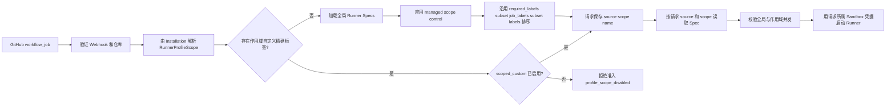

# 用户作用域 Runner 配置 Implementation Plan

> **For agentic workers:** REQUIRED SUB-SKILL: Use `superpowers:subagent-driven-development`（推荐）或 `superpowers:executing-plans` 逐项执行本计划；实现功能或修复缺陷时使用 `superpowers:test-driven-development`，声称完成前使用 `superpowers:verification-before-completion`。所有任务使用复选框跟踪，未经用户明确授权不得推送、创建 PR、合并或部署。

**Goal:** 在不开放现有 Admin Runner Spec API、不破坏全局托管目录和历史数据库的前提下，让普通用户在自己的个人账户或 GitHub Organization 作用域内查看有效 Runner 类型、控制托管类型，并使用该作用域的 Sandbox 凭据创建自定义 Runner 类型。

**Architecture:** 保留 `runner_profiles` 作为全局平台目录；新增作用域托管控制表和作用域自定义 Spec 表。GitHub Webhook 准入先从 Installation 解析个人账户或 Organization 作用域，优先匹配该作用域内的精确自定义标签，再回退到应用作用域控制后的全局目录。用户自定义模板只用所属作用域的 Sandbox 凭据验证，所有数据变更与审计事件在同一事务中提交。

**Tech Stack:** Go、GORM、SQLite、PostgreSQL、MySQL、React 19、TypeScript、Bun、i18next、Qiniu Sandbox SDK、GitHub App OAuth。

**Prepared:** 2026-08-28，Asia/Shanghai。

**Repository:** `qiniu/ci-runner`；所有路径和命令均相对于仓库根目录。

**Plan branch:** `docs/user-scoped-runner-configuration-plan`。

**Base branch and commit:** `main` at `b36f054064ba03ef6d51fe1d2a6ebbefed5ea94b`（`perf(state): stop storing webhook payloads (#88)`）。

**Implementation status:** 本地实现已完成，按阶段提交了 State、匹配与生命周期、User API、Runner Types UI 和文档；真实 Provider/GitHub E2E、跨方言数据库、降级门禁和部署仍未执行。

## Global Constraints

- 普通用户侧产品名使用“Runner 类型”，内部代码和 API 可以继续使用 `Runner Spec`；不要向普通用户暴露 `required_labels`、`priority`、`managed_by`、`catalog_revision` 和 `Min Idle`。
- 不得把现有 `/runner_specs` Admin API 改成普通用户可访问；现有 API、Admin UI 和全局 `runner_profiles` 行为保持兼容。
- 平台托管目录的标签、稳定模板名、优先级和目录版本只由 runnerd 管理；用户只能在自己的作用域内启停托管类型和设置附加并发上限。
- 用户自定义 Spec 必须绑定 `account` 或 `github_installation` 作用域，只能使用该作用域显式配置或合法继承的 Sandbox 凭据验证；不得使用 Admin 默认凭据验证用户自定义模板。
- Account／Organization Runner Types Settings 和 `/user/runner-specs` API 都沿用现有 `accountPreferenceScopeManageable` 授权边界；不可管理的 Installation 不得读取完整目录或进入 Settings。仓库外部协作者只在 `/repositories` 查看仓库级有效就绪状态，不获得私有模板、完整配置或配置入口。
- 个人 GitHub Installation 在能够映射到本地账户时使用 `account:<account_id>`；Organization 使用 `github_installation:<installation_id>`。解析失败时只使用全局目录，不猜测其他账户或组织。
- 自定义 Spec 使用精确工作流标签：持久化时 `labels` 与 `required_labels` 都等于规范化后的 `workflow_labels`。同一作用域内相同标签集合只能存在一个自定义 Spec。
- 作用域自定义 Spec 与全局 Spec 标签相同时，作用域自定义 Spec 明确覆盖当前作用域的全局匹配；这个覆盖在自定义 Spec 停用时仍作为显式屏蔽存在，不得静默回退到同标签全局 Spec。UI 必须显示覆盖提示。名称不得与当前有效的全局 Spec 重复。
- Admin 全局 `enabled=false` 不能被作用域控制重新启用。托管 Spec 的有效状态为 `global.enabled && scope.enabled`。
- Admin 全局 `max_concurrency` 继续限制所有作用域的该全局 Spec；用户设置的是额外的作用域上限。两个正数上限同时存在时必须同时满足，`0` 表示该层不增加限制。
- 所有新表和 `runner_requests` 新列只能通过向后兼容的增量迁移添加。不得重建现有 SQLite `runner_profiles` 或 `runner_requests` 表，不得删除、重命名或修复历史行。
- 新增、更新、删除和重置作用域配置必须与审计事件原子提交。校验失败或审计写入失败时不能留下部分数据。
- Sandbox Provider I/O 必须发生在数据库事务之外；写入时使用初始 `updated_at` 做条件更新，竞争修改或删除返回 `409 runner_spec_conflict`。
- 不新增内部 Runner Group、Repository Policy 或仓库级授权模型；第一阶段不支持每个 Repository 单独覆盖 Runner 类型。
- 不清理历史 `github_payload_json`，不改变普通用户 Jobs 授权，不改变 Sandbox 凭据加密、遮罩和请求快照语义。
- UI 只修改 `ui/` 源码，不手工修改 `internal/server/ui/`。英文和中文资源必须同步，固定文案必须通过 i18next。
- 不提交真实 Sandbox API Key、OAuth Token、本地 SQLite、`runnerd.local.yaml`、`.smee-url`、Cookie 或生产导出。

---

## 1. 背景与当前基线

### 1.1 当前已经具备的能力

- 普通用户已经有 `/user/preferences`、`/user/preferences/sandbox`、`/user/sandbox/templates` 和 `/user/sandbox/instances`，能够按个人账户或 GitHub Installation 配置 Sandbox 并读取目录。
- 用户设置已经区分 `/account/...` 和 `/organizations/{login}/...`，前端通过 `installation_id` 选择作用域。
- Sandbox 凭据支持个人账户、Organization、自定义、合法继承和受众受限的 Admin 默认回退。
- Webhook 请求已经持久化 `github_installation_id`，Sandbox 生命周期会根据请求解析所属凭据。
- 全局 Runner Spec 已有托管目录、自定义 Spec、标签匹配、并发限制、CAS 条件写入和原子审计。

### 1.2 当前缺口

- `/runner_specs` 的列表、创建、匹配、修改和删除全部要求 Admin 身份。
- `runner_profiles.name` 是全局主键，没有账户或 Organization 作用域。
- `MatchProfile(repositoryFullName, labels)` 不接收 GitHub Installation 或用户作用域。
- 生命周期按 `req.ProfileName` 重新读取全局 Spec；不同作用域不能安全使用同名自定义 Spec。
- 普通用户虽然能看到自己的 Sandbox 模板，但不能把私有模板映射为自己的 GitHub Actions `runs-on` 类型。
- 直接给现有 Admin API 换鉴权会造成跨租户读取、名称冲突、模板凭据错用和全局并发语义破坏。

### 1.3 本计划解决的用户任务

1. 个人账户管理员查看当前账户能够使用的 Runner 类型和对应 `runs-on` 标签。
2. Organization 成员在现有可管理边界内查看和配置该 Organization 的 Runner 类型。
3. 作用域管理者停用不需要的托管类型，或为其设置额外并发上限。
4. 作用域管理者从自己的 Sandbox 模板中创建自定义 Runner 类型。
5. 仓库外部协作者在 `/repositories` 查看仓库是否具备可运行的 Runner／Sandbox 就绪状态，但不能进入对应 Organization Settings 或读取完整 Runner 类型配置。
6. 平台管理员继续维护稳定的全局目录、Admin 默认 Sandbox、受众、诊断和全局审计。

## 2. 需求范围

### 2.1 功能需求

#### FR-1：作用域列表

- `GET /user/runner-specs` 返回个人账户的有效 Runner 类型。
- `GET /user/runner-specs?installation_id=<id>` 返回已关联 GitHub Installation 的有效 Runner 类型。
- Account 请求只允许当前账户；Installation 请求还必须通过 `accountPreferenceScopeManageable`。不可管理、repository-only 或已失效成员关系统一返回 `403 runner_spec_scope_forbidden`，不得返回完整目录。
- 每个条目标记 `source`：`managed`、`platform_custom` 或 `scoped_custom`。
- 条目包含用户需要的名称、工作流标签、启用状态、全局上限、作用域上限、有效上限、模板显示名和覆盖状态。
- API 只服务可管理作用域，因此作用域管理者可以读取自定义 Spec 的原始 `template_id`；仓库外部协作者只能从 `/repositories` 获得不含私有资源 ID 的就绪状态。

#### FR-2：托管类型控制

- `PUT /user/runner-specs/{name}/control` 创建或替换托管 Spec 的作用域控制。
- 请求只接受 `enabled` 和 `max_concurrency`。
- `DELETE /user/runner-specs/{name}/control?expected_updated_at=<RFC3339>` 删除控制并恢复继承全局行为。
- 只有 `managed_by` 非空的全局托管 Spec 可以建立作用域控制；Admin 自定义全局 Spec 保持只读兼容。
- 用户设置 `enabled=true` 时，如果全局已停用，响应仍显示有效状态为停用并说明来源。

#### FR-3：自定义类型

- `POST /user/runner-specs` 创建作用域自定义 Spec。
- 请求字段固定为：`name`、`workflow_labels`、`template_id`、`runner_group`、`max_concurrency`、`enabled`。
- `PATCH /user/runner-specs/{name}` 修改作用域自定义 Spec；名称和作用域不可修改。
- `DELETE /user/runner-specs/{name}?expected_updated_at=<RFC3339>` 删除作用域自定义 Spec。
- 名称沿用 `ValidateProfile` 的安全约束：trim 后非空、单路径段、不得包含 `/`，不得等于 `.` 或 `..`。
- `workflow_labels` trim、去空、去重并排序后，对规范化 JSON 计算 SHA-256，生成稳定 `label_key`；空集合拒绝。
- 相同作用域和 `label_key` 只能有一个自定义 Spec。
- `runner_group` 只允许 Organization Installation；个人账户请求非空值返回 `400 runner_group_not_supported`。
- 创建和修改 `template_id` 时验证模板。未改变模板的控制修改不得调用 Provider。
- 删除或改变模板、标签前，如果该 Spec 仍有 queued、creating、running 或 stopping 请求，返回 `409 runner_spec_in_use`。

#### FR-4：匹配与生命周期

- Webhook `workflow_job` 和 `workflow_run` 路径必须把 `github_installation_id` 传入作用域解析和匹配。
- 匹配顺序固定为：先查询作用域自定义精确标签（不按 `enabled` 过滤）→ 若存在且启用则命中该 Spec；若存在但停用则返回未匹配并记录稳定原因 `profile_scope_disabled`；只有不存在精确作用域自定义 Spec 时，才进入应用作用域控制后的现有全局匹配。
- 自定义精确匹配不使用用户可编辑优先级。
- 请求持久化匹配来源、作用域类型和作用域 ID；旧请求的空来源继续按全局 Spec 处理。
- 生命周期按请求保存的来源和作用域读取 Spec，不允许仅按名称跨作用域查找。
- 托管全局 Spec 同时执行全局并发上限和作用域并发上限；自定义 Spec 只执行作用域并发上限以及 runnerd 全局 `MaxConcurrentRunners`。
- Retry 不重新匹配其他 Spec；继续使用请求原先保存的来源、作用域和名称。

#### FR-5：用户界面

- 增加 `/account/runner-types` 和 `/organizations/{login}/runner-types`。
- 在普通用户 Settings 增加“Runner 类型”Tab，不加入 Admin Sidebar。
- 列表显示有效状态、来源、`runs-on` 标签、模板、全局上限、作用域上限和覆盖状态。
- 支持复制可直接使用的 YAML，例如：

  ```yaml
  runs-on: [self-hosted, qiniu-custom]
  ```

- 托管类型只显示“启用”和“最大并发”控制，提供“恢复平台默认值”。
- 自定义类型使用独立对话框，模板来自当前作用域的 Sandbox 模板目录。
- 当 Sandbox 来源为 `admin_default` 或 `none` 时，禁用“创建自定义类型”，并链接到当前作用域 Preferences。
- 当标签覆盖全局类型时，在保存前显示明确提示，并在列表标记“覆盖平台类型”。
- 不可管理 Organization 不显示 Runner Types Settings 入口；直接访问路由显示无权限状态且不得发起目录请求。仓库外部协作者的只读就绪信息继续由 `/repositories` 承载。
- 保存期间禁止重复提交；失败后保留表单；成功后刷新列表并显示 i18n Toast。

### 2.2 非功能需求

- **隔离性：** 同名或同标签的两个作用域不能互相读取、修改、计数或匹配。
- **兼容性：** 没有作用域配置时，现有工作流、Admin API、Admin UI、托管目录和全局自定义 Spec 行为不变。
- **安全性：** 用户模板验证不得回退到 Admin 凭据；API 响应不得泄露 API Key、加密值、Provider 响应体或其他作用域的模板 ID。
- **一致性：** 数据变更与审计同事务；Provider 校验与 DB 写入之间的竞争用 CAS 检出。
- **可观测性：** 日志包含 `profile_source`、`profile_scope_type`、`profile_scope_id` 和 `profile_name`，不包含凭据。
- **可回滚性：** 新表和新列全部是增量添加；只有第 6 节定义的降版本门禁证明基线提交 `b36f054064ba03ef6d51fe1d2a6ebbefed5ea94b` 能打开升级后的 SQLite 副本并通过健康检查后，才允许声明旧版本可启动。回滚前必须先停用用户侧入口，并告知依赖自定义标签的工作流会失去匹配。

### 2.3 明确非目标

- 不支持仓库级 Runner Policy、Spec 集合或内部 Runner Group。
- 不允许普通用户修改全局托管标签、优先级、稳定模板名和目录版本。
- 不向普通用户开放 Admin Diagnostics、Audit 全量查询、Sandbox 默认受众或跨账户管理。
- 不实现 `Min Idle` 或预热。
- 不实现用户自定义 Spec 的版本历史、草稿、审批流、批量导入或跨作用域复制。
- 不改变 GitHub Organization Runner Group 的 GitHub 权限模型；只保留为 Organization 高级字段。
- 不在本工作中删除任何遗留表、列或历史 Webhook Payload。

## 3. 产品与权限模型

### 3.1 页面责任

| 页面 | 责任 | 可修改者 |
| --- | --- | --- |
| `/admin/runner_specs` | 全局托管目录控制、Admin 自定义全局 Spec | Admin |
| `/admin/sandbox_service` | 平台默认 Sandbox 与受众 | Admin |
| `/account/runner-types` | 个人账户有效类型、托管控制、自定义类型 | 当前账户 |
| `/organizations/{login}/runner-types` | Organization 有效类型、托管控制、自定义类型 | 现有 manageable 成员 |
| `/repositories` | 仓库对应作用域的 Runner 与 Sandbox 就绪状态 | 有仓库访问权的用户，只读 |

### 3.2 字段可见性

| 字段 | Admin | 作用域管理者 | `/repositories` 外部协作者就绪视图 |
| --- | --- | --- | --- |
| 名称、来源、工作流标签 | 读写或目录管理 | 读取；自定义可写 | 仅显示仓库运行所需的稳定公开标签摘要 |
| `template_id` | Admin 全局可见 | 仅自定义可见和可写 | 不返回 |
| 稳定模板名 | 目录管理 | 读取 | 不返回 |
| `enabled` | 全局控制 | 作用域控制 | 只显示聚合后的“就绪／未就绪” |
| `max_concurrency` | 全局控制 | 作用域附加上限 | 不返回 |
| `required_labels`、`priority` | 可见 | 隐藏 | 隐藏 |
| `runner_group` | Admin 全局或 Organization 高级设置 | Organization 自定义可写 | 不返回 |
| `managed_by`、`catalog_revision` | 可见 | 隐藏 | 隐藏 |
| `min_idle` | 暂留兼容字段 | 隐藏 | 隐藏 |

### 3.3 作用域解析

| 输入 | 解析结果 | 失败行为 |
| --- | --- | --- |
| UI 无 `installation_id` | 当前本地 `account:<id>` | Session 无效返回 401 |
| UI 有个人 Installation | 归属当前用户的个人账户作用域 | 未关联返回 400/404 |
| UI 有 Organization Installation | `github_installation:<installation_id>` | 未关联返回 400/404；不可管理返回 403 |
| Webhook 个人 Installation | `AccountScopeForPersonalGitHubInstallation` 返回的账户 | 无映射时只用全局目录 |
| Webhook Organization Installation | `github_installation:<installation_id>` | Owner 元数据缺失时只用全局目录并记录告警 |
| Admin 手动请求无 Installation | 全局目录 | 不应用任何用户作用域配置 |

### 3.4 有效状态与并发公式

托管 Spec：

```text
effective_enabled = global.enabled AND (control missing OR control.enabled)

global_limit_ok = global.max_concurrency <= 0
               OR global_in_flight < global.max_concurrency

scope_limit_ok = control missing
              OR control.max_concurrency <= 0
              OR scope_in_flight < control.max_concurrency

can_start = effective_enabled AND global_limit_ok AND scope_limit_ok
```

作用域自定义 Spec：

```text
can_start = custom.enabled
         AND (custom.max_concurrency <= 0
              OR scope_in_flight < custom.max_concurrency)
```

两类 Spec 仍受 runnerd 配置中的全局 `MaxConcurrentRunners` 限制。

API 展示的有效并发上限使用 `minPositive(global_limit, scope_limit)`：忽略不大于 0 的值；如果两个值都不大于 0，返回 0；否则返回最小正数。作用域自定义 Spec 的 `global_limit` 固定为 0。

## 4. 技术设计

### 4.1 准入数据流



### 4.2 新增状态类型

在 `internal/state/store.go` 增加以下稳定接口类型；JSON 字段用于 User API，内部 `LabelKey` 不输出：

```go
type RunnerProfileScope struct {
    Type string `json:"scope_type"`
    ID   int64  `json:"scope_id"`
}

type RunnerProfileControl struct {
    ScopeType     string    `json:"scope_type"`
    ScopeID       int64     `json:"scope_id"`
    ProfileName   string    `json:"name"`
    Enabled       bool      `json:"enabled"`
    MaxConcurrency int      `json:"max_concurrency"`
    CreatedAt     time.Time `json:"created_at"`
    UpdatedAt     time.Time `json:"updated_at"`
}

type ScopedRunnerProfile struct {
    ScopeType      string    `json:"scope_type"`
    ScopeID        int64     `json:"scope_id"`
    Name           string    `json:"name"`
    WorkflowLabels []string  `json:"workflow_labels"`
    LabelKey       string    `json:"-"`
    TemplateID     string    `json:"template_id,omitempty"`
    RunnerGroup    string    `json:"runner_group,omitempty"`
    MaxConcurrency int       `json:"max_concurrency"`
    Enabled        bool      `json:"enabled"`
    CreatedAt      time.Time `json:"created_at"`
    UpdatedAt      time.Time `json:"updated_at"`
}

type EffectiveRunnerProfile struct {
    Source              string               `json:"source"`
    ScopeType           string               `json:"scope_type,omitempty"`
    ScopeID             int64                `json:"scope_id,omitempty"`
    Profile             RunnerProfile        `json:"-"`
    WorkflowLabels      []string             `json:"workflow_labels"`
    GlobalMaxConcurrency int                 `json:"global_max_concurrency"`
    ScopeMaxConcurrency int                  `json:"scope_max_concurrency"`
    EffectiveEnabled    bool                 `json:"enabled"`
    OverridesGlobal     bool                 `json:"overrides_global"`
    Editable            bool                 `json:"editable"`
}
```

实现时允许按 Go 格式化调整对齐，但字段名、JSON 名称和语义不得漂移。`EffectiveRunnerProfile.Profile` 只在服务端使用；User API 通过专用响应 DTO 控制敏感字段。

现有 `ProfileMatch` 增加可选身份字段，让准入层无需根据名称再次猜测来源：

```go
type ProfileMatch struct {
    RepositoryFullName string         `json:"repository_full_name"`
    Labels             []string       `json:"labels"`
    Profile            *RunnerProfile `json:"runner_spec,omitempty"`
    Source             string         `json:"runner_spec_source,omitempty"`
    ScopeType          string         `json:"runner_spec_scope_type,omitempty"`
    ScopeID            int64          `json:"runner_spec_scope_id,omitempty"`
    Reason             string         `json:"reason,omitempty"`
}
```

全局旧调用返回 `Source="global"` 和空 scope；作用域自定义匹配返回 `Source="scoped_custom"` 及精确 scope；应用作用域控制后命中的全局 Spec 返回 `Source="global"` 及本次解析到的 scope。停用的精确作用域自定义项返回空 `Profile`、`Source="scoped_custom"`、精确 scope 和 `Reason="profile_scope_disabled"`，供拒绝请求和日志保留明确原因。

### 4.3 新增数据库表

#### `runner_profile_scope_controls`

| 列 | 类型与约束 | 含义 |
| --- | --- | --- |
| `scope_type` | text/varchar，复合主键 1 | `account` 或 `github_installation` |
| `scope_id` | bigint，复合主键 2 | 本地 Account ID 或 GitHub Installation ID |
| `profile_name` | text/varchar，复合主键 3 | 全局托管 Spec 名称 |
| `enabled` | not null | 用户作用域开关 |
| `max_concurrency` | not null，default 0 | 作用域附加并发上限 |
| `created_at` | not null | 创建时间 |
| `updated_at` | not null | CAS 修订时间 |

索引：

```text
PRIMARY KEY (scope_type, scope_id, profile_name)
INDEX idx_runner_profile_scope_controls_scope (scope_type, scope_id)
```

#### `scoped_runner_profiles`

| 列 | 类型与约束 | 含义 |
| --- | --- | --- |
| `scope_type` | text/varchar，复合主键 1 | 作用域类型 |
| `scope_id` | bigint，复合主键 2 | 作用域 ID |
| `name` | text/varchar，复合主键 3 | 作用域内名称 |
| `workflow_labels_json` | text，not null | 规范化、排序后的标签数组 |
| `label_key` | char/varchar(64)，not null | 规范化标签 JSON 的 SHA-256 十六进制值 |
| `template_id` | text/varchar，not null | 作用域凭据可访问的模板 ID |
| `runner_group` | text/varchar | Organization 高级注册目标 |
| `max_concurrency` | integer，not null | 作用域上限，0 表示不增加限制 |
| `enabled` | boolean，not null | 自定义 Spec 状态 |
| `created_at` | not null | 创建时间 |
| `updated_at` | not null | CAS 修订时间 |

索引：

```text
PRIMARY KEY (scope_type, scope_id, name)
UNIQUE INDEX idx_scoped_runner_profiles_scope_labels
    (scope_type, scope_id, label_key)
INDEX idx_scoped_runner_profiles_scope (scope_type, scope_id)
```

`label_key` 的构造必须先 trim、移除空值、去重、按字节序排序，使用 `encoding/json` 生成无空白规范数组，再计算 `sha256.Sum256` 并编码为 64 位小写十六进制。这样避免 MySQL 长索引和分隔符歧义；唯一索引冲突仍需读取已存标签，确认是重复集合后映射为 `runner_spec_labels_conflict`。

### 4.4 `runner_requests` 增量字段

在现有 `runnerRequestRecord` 和 `RunnerRequest`／`RunnerState` 中增加：

```go
ProfileSource    string `gorm:"column:profile_source" json:"runner_spec_source,omitempty"`
ProfileScopeType string `gorm:"column:profile_scope_type" json:"runner_spec_scope_type,omitempty"`
ProfileScopeID   int64  `gorm:"column:profile_scope_id" json:"runner_spec_scope_id,omitempty"`
```

索引：

```text
INDEX idx_runner_requests_profile_scope_status
    (profile_source, profile_scope_type, profile_scope_id, profile_name, status)
```

兼容规则：

- 历史行三个字段为空／0 时解释为 `global`。
- 迁移不得回填猜测的作用域。
- 现有 `idx_runner_requests_profile_queued_id` 和其他自定义索引必须保留。
- SQLite 使用现有窄兼容迁移逐列 `ALTER TABLE ADD COLUMN` 和显式建索引；重复启动幂等。

### 4.5 State Store 接口

在 `RunnerCatalogStore` 和 `RunnerRequestStore` 中增加：

```go
ListEffectiveProfiles(scope RunnerProfileScope) ([]EffectiveRunnerProfile, error)
GetEffectiveProfile(scope RunnerProfileScope, source, name string) (EffectiveRunnerProfile, error)
MatchProfileForScope(scope RunnerProfileScope, repositoryFullName string, labels []string) (ProfileMatch, error)

GetProfileControl(scope RunnerProfileScope, name string) (RunnerProfileControl, error)
UpsertProfileControlIfUnchanged(control RunnerProfileControl, expectedUpdatedAt *time.Time) (RunnerProfileControl, error)
DeleteProfileControlIfUnchanged(scope RunnerProfileScope, name string, expectedUpdatedAt *time.Time) error

ListScopedProfiles(scope RunnerProfileScope) ([]ScopedRunnerProfile, error)
GetScopedProfile(scope RunnerProfileScope, name string) (ScopedRunnerProfile, error)
UpsertScopedProfileIfUnchanged(profile ScopedRunnerProfile, expectedUpdatedAt *time.Time) (ScopedRunnerProfile, error)
DeleteScopedProfileIfUnchanged(scope RunnerProfileScope, name string, expectedUpdatedAt *time.Time) error

ActiveCountForProfileScope(source string, scope RunnerProfileScope, name string) (int, error)
InFlightCountForProfileScope(source string, scope RunnerProfileScope, name string) (int, error)
```

行为约束：

- `ListEffectiveProfiles` 不做鉴权，只组合状态；HTTP 层必须先确认调用者可管理该作用域，不能把 Store 的可读性解释成 repository-only 用户的产品权限。
- `MatchProfileForScope` 先按 `label_key` 查询单一精确自定义标签且不预先过滤 `enabled`。命中启用项时返回 scoped custom；命中停用项时返回空 Profile 和 `Reason="profile_scope_disabled"`，明确阻止同标签全局回退；不存在精确项时才复用当前全局 `profileMatchFromCandidates`。
- 全局候选应用托管控制时，不修改原始 `runner_profiles` 行。
- `GetEffectiveProfile` 的 `source` 必须是 `global` 或 `scoped_custom`；未知值返回 `ErrNotFound`。
- 条件写入沿用当前 `ErrConflict` 和至少 1 ms 单调修订语义。
- 所有 scope type 必须经过共享 `ValidateRunnerProfileScope`，只接受现有两个常量和正 ID。

### 4.6 User API

新增路由：

```go
s.mux.HandleFunc("GET /user/runner-specs", s.handleUserListRunnerSpecs)
s.mux.HandleFunc("POST /user/runner-specs", s.handleUserCreateRunnerSpec)
s.mux.HandleFunc("PATCH /user/runner-specs/{name}", s.handleUserPatchRunnerSpec)
s.mux.HandleFunc("DELETE /user/runner-specs/{name}", s.handleUserDeleteRunnerSpec)
s.mux.HandleFunc("PUT /user/runner-specs/{name}/control", s.handleUserPutRunnerSpecControl)
s.mux.HandleFunc("DELETE /user/runner-specs/{name}/control", s.handleUserDeleteRunnerSpecControl)
```

列表响应：

```json
{
  "scope_type": "github_installation",
  "scope_id": 987,
  "sandbox_source": "custom",
  "items": [
    {
      "name": "qiniu-ubuntu-24.04",
      "source": "managed",
      "workflow_labels": ["qiniu", "ubuntu-24.04"],
      "default_template_name": "qiniu-ubuntu-24.04",
      "enabled": true,
      "global_max_concurrency": 10,
      "scope_max_concurrency": 2,
      "effective_max_concurrency": 2,
      "overrides_global": false,
      "editable": true
    }
  ]
}
```

创建以外的 Mutation 都必须携带客户端最后读取到的修订时间：PATCH 和 PUT 在 JSON 中发送 `expected_updated_at`；DELETE 在 Query 中发送 RFC3339 `expected_updated_at`。缺失或无法解析返回 `400 invalid_runner_spec_revision`，与当前值不一致返回 `409 runner_spec_conflict`。

创建请求：

```json
{
  "name": "org-linux-large",
  "workflow_labels": ["self-hosted", "org-linux-large"],
  "template_id": "template-owned-by-org",
  "runner_group": "large-runners",
  "max_concurrency": 2,
  "enabled": true
}
```

托管控制请求：

```json
{
  "enabled": true,
  "max_concurrency": 2,
  "expected_updated_at": "2026-08-28T10:00:00Z"
}
```

错误码必须稳定：

| HTTP | `code` | 场景 |
| --- | --- | --- |
| 400 | `invalid_runner_spec` | 名称、标签、并发或字段非法 |
| 400 | `invalid_runner_spec_revision` | Mutation 缺少合法的 RFC3339 修订时间 |
| 400 | `runner_group_not_supported` | 个人作用域设置 Runner Group |
| 401 | 现有 Session 错误 | 未登录或 Session 无效 |
| 403 | `runner_spec_scope_forbidden` | 当前用户不能管理该作用域 |
| 404 | `runner_spec_not_found` | 目标不存在或不属于该作用域 |
| 409 | `sandbox_service_not_configured` | 没有作用域自有／继承凭据 |
| 409 | `runner_spec_conflict` | CAS 竞争修改或删除 |
| 409 | `runner_spec_in_use` | 活跃请求阻止模板、标签变更或删除 |
| 409 | `runner_spec_name_conflict` | 名称与有效全局 Spec 冲突 |
| 409 | `runner_spec_labels_conflict` | 同作用域已有相同精确标签 |
| 400 | `template_not_found` / `template_not_ready` | Provider 确认模板不可用 |
| 502 | `sandbox_template_access_denied` / `template_validation_unavailable` | Provider 鉴权或上游失败 |
| 504 | `template_validation_timeout` | 5 秒总截止时间到期 |

User API Provider 错误不得转发上游响应体。模板验证应提取通用错误映射，Admin 仍使用 `validateAdminProfileTemplate`，User 使用新的 `validateScopedProfileTemplate`，两者只共享安全错误分类，不共享凭据解析器。

### 4.7 审计事件

| Action | Resource type | Resource ID |
| --- | --- | --- |
| `user_runner_spec.create` | `scoped_runner_profile` | `<scope_type>:<scope_id>:<name>` |
| `user_runner_spec.update` | `scoped_runner_profile` | `<scope_type>:<scope_id>:<name>` |
| `user_runner_spec.delete` | `scoped_runner_profile` | `<scope_type>:<scope_id>:<name>` |
| `user_runner_spec_control.upsert` | `runner_profile_scope_control` | `<scope_type>:<scope_id>:<name>` |
| `user_runner_spec_control.delete` | `runner_profile_scope_control` | `<scope_type>:<scope_id>:<name>` |

Actor 使用现有 `github:<oauth_subject>`。Payload 只记录非敏感字段、旧／新控制值和模板 ID 是否变化，不记录 API URL、API Key、加密密文、Provider Body 或 GitHub Token。

## 5. 文件改动地图

| 文件 | 责任 |
| --- | --- |
| `internal/state/records.go` | 新表、请求作用域字段和索引的 GORM 记录 |
| `internal/state/store.go` | 新领域类型和 Store 接口 |
| `internal/state/conversions.go` | Record 与领域类型转换 |
| `internal/state/scoped_catalog.go` | 作用域控制、自定义 Spec、有效列表和匹配 |
| `internal/state/runner_requests.go` | 作用域计数和请求字段持久化 |
| `internal/state/db.go` | 新表 AutoMigrate 与 SQLite 请求增量迁移 |
| `internal/state/store_test.go` | 新旧 Schema、匹配、CAS、审计、跨方言测试 |
| `internal/server/server.go` | User Runner Spec 路由 |
| `internal/server/server_runner_profile_scope.go` | Installation → RunnerProfileScope 解析 |
| `internal/server/server_user_runner_specs.go` | User API、DTO、授权和审计 |
| `internal/server/server_profile_validation.go` | 安全错误分类和作用域模板验证 |
| `internal/server/server_runner_lifecycle.go` | 作用域匹配、读取和并发门控 |
| `internal/server/server_webhooks.go` | Webhook 准入传递 Installation 作用域 |
| `internal/server/server_test.go` | API、授权、Provider、Webhook 和生命周期回归 |
| `ui/src/admin-types.ts` | User Runner 类型 DTO 类型；后续可改名为共享类型文件 |
| `ui/src/app-load-policy.ts` | 新个人／Organization 路由和加载策略 |
| `ui/src/hooks/use-user-runner-catalog.ts` | User API 加载、保存、删除和 Pending 状态 |
| `ui/src/components/user-runner-types-section.tsx` | 列表、托管控制、自定义表单和只读态 |
| `ui/src/components/user-dashboard.tsx` | Settings Tab 接入和作用域传递 |
| `ui/src/App.tsx` | 路由解析、加载和导航回调 |
| `ui/src/locales/en.ts`、`ui/src/locales/zh.ts` | 双语固定文案 |
| `ui/src/**/*.test.js` | 路由、Hook、组件和权限 UI 回归 |
| `ui/e2e/production-smoke.pw.ts` | Account／Organization Runner Types 的本地 fixture-backed 生产 Bundle 回归 |
| `ui/e2e/production-smoke-support.ts`、`ui/e2e/production-smoke-support.test.ts` | Production Smoke 路由判定和 Fixture 辅助函数 |
| `scripts/verify-sqlite-downgrade.sh` | 在临时 SQLite 副本上验证当前版本升级与基线二进制降版本启动 |
| `README.md`、`README.zh.md` | 当前产品能力和限制 |
| `docs/testing.md`、`docs/zh/testing.md` | 本地／真实 GitHub 测试方法 |
| `docs/deployment-smoke.md`、`docs/zh/deployment-smoke.md` | 部署验收和清理 |
| `docs/README.md`、`docs/zh/README.md` | 文档索引 |
| `TODO.md` | 移除已完成的用户 Spec 待办，保留未决运营事项 |
| `AGENTS.md`、`.agents/rules/*` | 固化作用域、凭据、迁移和验证边界 |

不要因为 `admin-types.ts` 名称不理想而在本功能中做大范围类型重构；只在新增类型无法保持边界时创建 `ui/src/user-runner-types.ts`。

## 6. 执行计划

### Task 1：新增作用域状态模型与兼容迁移

**Files:**

- Modify: `internal/state/records.go`
- Modify: `internal/state/store.go`
- Modify: `internal/state/conversions.go`
- Modify: `internal/state/db.go`
- Modify: `internal/state/runner_requests.go`
- Test: `internal/state/store_test.go`

**Interfaces:**

- Produces: `RunnerProfileScope`、`RunnerProfileControl`、`ScopedRunnerProfile`、`ProfileMatch` 身份字段和请求的 `ProfileSource`／`ProfileScopeType`／`ProfileScopeID`。
- Produces: 两个新表和请求作用域索引；后续任务依赖这些物理字段。

- [ ] **Step 1：写新 Schema 与旧 SQLite 升级失败测试**

  增加以下测试，先只表达目标，不改实现：

  ```go
  func TestFreshSchemaIncludesScopedRunnerCatalog(t *testing.T)
  func TestMigrateSQLiteRunnerRequestAddsProfileScopeWithoutLosingRows(t *testing.T)
  func TestMigrateSQLiteScopedRunnerCatalogIsIdempotent(t *testing.T)
  func TestScopedRunnerCatalogFreshSchemaSQLBackends(t *testing.T)
  ```

  断言新表、主键、唯一索引和请求索引存在；构造包含历史 `runner_profiles`、`runner_requests` 和自定义索引的 SQLite，连续启动两次后逐行比较原值和索引。

- [ ] **Step 2：运行测试并确认预期失败**

  Run:

  ```bash
  go test ./internal/state -run 'Test(FreshSchemaIncludesScopedRunnerCatalog|MigrateSQLiteRunnerRequestAddsProfileScopeWithoutLosingRows|MigrateSQLiteScopedRunnerCatalogIsIdempotent)' -count=1 -v
  ```

  Expected: FAIL，原因必须是新表、字段、索引或类型尚不存在；不能接受无关编译错误。

- [ ] **Step 3：实现记录、领域类型和迁移**

  按第 4.2–4.4 节精确增加字段。新表加入 `AutoMigrate`；现有 SQLite `runner_requests` 通过窄迁移添加字段和 `idx_runner_requests_profile_scope_status`，不得让 GORM 重建表。

- [ ] **Step 4：实现请求读写转换**

  `CreateRequest`、`CreateRejectedRequest`、`ReadRequest`、`ReadState`、Retry 和列表查询必须保留三个新字段。旧行空值转换为 `ProfileSource == ""`，由服务层兼容解释为 global，不做 DB 回填。

- [ ] **Step 5：运行 State 测试**

  Run:

  ```bash
  go test ./internal/state -count=1
  ```

  Expected: PASS，包括旧 SQLite 升级、重复迁移和现有 Payload 保留测试。

- [ ] **Step 6：提交独立迁移变更**

  ```bash
  git add internal/state/records.go internal/state/store.go internal/state/conversions.go internal/state/db.go internal/state/runner_requests.go internal/state/store_test.go
  git commit -m "feat(state): add scoped runner catalog schema"
  ```

### Task 2：实现作用域目录、CAS 和匹配

**Files:**

- Create: `internal/state/scoped_catalog.go`
- Modify: `internal/state/store.go`
- Modify: `internal/state/catalog.go`
- Modify: `internal/state/runner_requests.go`
- Test: `internal/state/store_test.go`

**Interfaces:**

- Consumes: Task 1 的作用域记录和请求字段。
- Produces: 第 4.5 节全部 Store 方法。
- Produces: `NormalizeWorkflowLabels(labels []string) ([]string, string, error)`，HTTP 和 UI 测试使用相同规范化结果。

- [ ] **Step 1：写隔离、CAS 和匹配失败测试**

  ```go
  func TestScopedRunnerProfilesAreIsolatedByScope(t *testing.T)
  func TestScopedRunnerProfileRejectsDuplicateNormalizedLabels(t *testing.T)
  func TestScopedRunnerProfileConditionalWritesRejectStaleRevision(t *testing.T)
  func TestManagedProfileControlCannotEnableGloballyDisabledProfile(t *testing.T)
  func TestMatchProfileForScopePrefersExactScopedCustomProfile(t *testing.T)
  func TestMatchProfileForScopeDisabledScopedCustomShadowsGlobal(t *testing.T)
  func TestMatchProfileForScopeFallsBackToGlobalOrdering(t *testing.T)
  func TestMatchProfileForScopeAppliesManagedControl(t *testing.T)
  func TestProfileScopeCountsDoNotCrossScopesOrSources(t *testing.T)
  func TestScopedCatalogMutationAndAuditAreAtomic(t *testing.T)
  ```

  至少使用两个 Account scope、两个 Installation scope、相同名称、相同标签和相同请求状态证明隔离。

- [ ] **Step 2：运行聚焦测试并确认失败**

  ```bash
  go test ./internal/state -run 'Test(ScopedRunner|ManagedProfileControl|MatchProfileForScope|ProfileScopeCounts)' -count=1 -v
  ```

  Expected: FAIL，缺少 Store 方法或行为未实现。

- [ ] **Step 3：实现标签规范化和 CRUD**

  `NormalizeWorkflowLabels` 必须返回排序后的新切片，不能修改调用者输入。创建使用普通 INSERT；更新／删除按 `(scope_type, scope_id, name, updated_at)` 条件执行，并把 0 行影响映射为 `ErrConflict`。

- [ ] **Step 4：实现有效目录和匹配**

  先按 `label_key` 查询作用域自定义 Spec，不在查询条件中加入 `enabled`。命中且启用时构造 `RunnerProfile{Labels: labels, RequiredLabels: labels}`；命中但停用时返回空 Profile、保留 scoped custom 身份并设置 `Reason="profile_scope_disabled"`，不得继续匹配同标签全局 Spec。只有作用域内不存在精确标签时，才加载全局候选，对 managed 候选应用 scope control，再调用现有 `profileMatchFromCandidates`，不得复制一份不同的排序算法。

- [ ] **Step 5：实现作用域计数**

  查询条件必须同时包含 `profile_source`、`profile_scope_type`、`profile_scope_id` 和 `profile_name`。旧 global 请求仍由现有 `InFlightCountForProfile` 计入全局上限。

- [ ] **Step 6：运行 State 全量和跨方言测试**

  ```bash
  go test ./internal/state -count=1

  test -n "$RUNNERD_POSTGRES_TEST_DSN"
  test -n "$RUNNERD_MYSQL_TEST_DSN"
  RUNNERD_CATALOG_BACKEND_TESTS=1 \
    go test ./internal/state -run 'Test(ApplyMutationWithAudit|FreshSchema|ScopedRunnerCatalog).*SQLBackends' -count=1 -v
  ```

  Expected: 本地测试 PASS；跨方言测试只有在提供专用 DSN 时才能记为 PASS，未提供必须记为 skipped/not run。

- [ ] **Step 7：提交目录状态变更**

  ```bash
  git add internal/state/scoped_catalog.go internal/state/store.go internal/state/catalog.go internal/state/runner_requests.go internal/state/store_test.go
  git commit -m "feat(state): resolve scoped runner specs"
  ```

### Task 3：接入 Webhook、生命周期和双层并发

**Files:**

- Create: `internal/server/server_runner_profile_scope.go`
- Modify: `internal/server/server_runner_lifecycle.go`
- Modify: `internal/server/server_webhooks.go`
- Modify: `internal/server/server_admin_handlers.go`
- Test: `internal/server/server_test.go`
- Test: `internal/server/server_default_templates_test.go`

**Interfaces:**

- Consumes: `MatchProfileForScope`、`GetEffectiveProfile` 和作用域计数。
- Produces:

  ```go
  func (s *Server) runnerProfileScopeForInstallation(ctx context.Context, installationID int64) (state.RunnerProfileScope, bool, error)
  func (s *Server) matchProfileForAdmission(scope state.RunnerProfileScope, repository string, labels []string) (state.ProfileMatch, error)
  ```

  `bool` 表示作用域是否可靠解析；false 必须走当前全局匹配。

- [ ] **Step 1：写准入与生命周期失败测试**

  ```go
  func TestWorkflowJobMatchesPersonalAccountScopedProfile(t *testing.T)
  func TestWorkflowJobMatchesOrganizationScopedProfile(t *testing.T)
  func TestWorkflowJobDisabledScopedProfileDoesNotFallBackToGlobal(t *testing.T)
  func TestWorkflowJobUnknownInstallationFallsBackToGlobalProfile(t *testing.T)
  func TestSameScopedProfileNameDoesNotCrossInstallations(t *testing.T)
  func TestRetryKeepsOriginalProfileSourceAndScope(t *testing.T)
  func TestQueuedScopedProfileDisabledBeforeStartDoesNotLaunch(t *testing.T)
  func TestManagedProfileEnforcesGlobalAndScopeConcurrency(t *testing.T)
  func TestScopedCustomProfileEnforcesOnlyScopeAndRunnerdLimits(t *testing.T)
  func TestLegacyQueuedRequestStillLoadsGlobalProfile(t *testing.T)
  ```

- [ ] **Step 2：运行测试并确认失败**

  ```bash
  go test ./internal/server -run 'Test(WorkflowJob.*ScopedProfile|SameScopedProfileName|RetryKeepsOriginalProfile|ManagedProfileEnforces|ScopedCustomProfileEnforces|LegacyQueuedRequest)' -count=1 -v
  ```

- [ ] **Step 3：实现作用域解析**

  Organization 根据 Installation Owner 元数据返回 Installation scope；个人 Installation 通过 `AccountScopeForPersonalGitHubInstallation` 返回 Account scope。元数据缺失或未同步时记录不含敏感信息的 Warn，并返回 `(zero, false, nil)` 兼容全局目录。

- [ ] **Step 4：修改全部准入调用点**

  `enqueueWorkflowJob`、`handleGitHubWebhook` 的 queued 分支和 Admin Match Preview 必须使用新签名。Admin Preview 显式传 zero scope，保持全局预览。

- [ ] **Step 5：持久化匹配身份**

  命中作用域自定义时保存 `ProfileSource="scoped_custom"` 和 scope；命中全局时保存 `ProfileSource="global"`，如果已解析作用域仍保存 scope，以便计算作用域托管上限。停用的精确作用域自定义项按 rejected request 持久化 `profile_scope_disabled` 和 scoped custom 身份，不能再次调用全局 Matcher。

- [ ] **Step 6：修改启动和 Retry 读取**

  把 `GetProfile(req.ProfileName)` 改为基于 `ProfileSource` 和 scope 的 `GetEffectiveProfile`。历史空来源只允许读取全局。读取后调用 `validateRequestedProfile` 检查最新有效启用状态和请求标签；Scope 在排队期间被停用时不得启动。Retry 不调用 Matcher。

- [ ] **Step 7：实现双层并发门控**

  全局来源先保留 `InFlightCountForProfile(name)`，再根据作用域控制执行 `InFlightCountForProfileScope`。自定义来源只执行 scope count。日志分别输出达到的限制层：`global_profile_capacity` 或 `scope_profile_capacity`。

- [ ] **Step 8：运行服务器和全量 Go 测试**

  ```bash
  go test ./internal/server -count=1
  go test ./... -count=1
  ```

- [ ] **Step 9：提交生命周期变更**

  ```bash
  git add internal/server/server_runner_profile_scope.go internal/server/server_runner_lifecycle.go internal/server/server_webhooks.go internal/server/server_admin_handlers.go internal/server/server_test.go internal/server/server_default_templates_test.go
  git commit -m "feat(runner): match specs within account scopes"
  ```

### Task 4：实现 User Runner Spec API 和作用域模板验证

**Files:**

- Create: `internal/server/server_user_runner_specs.go`
- Modify: `internal/server/server.go`
- Modify: `internal/server/server_profile_validation.go`
- Modify: `internal/server/server_user_handlers.go`
- Test: `internal/server/server_test.go`
- Test: `internal/server/server_helpers_test.go`

**Interfaces:**

- Consumes: 现有 `accountPreferenceScopeFromRequest` 和 `accountPreferenceScopeManageable`。
- Produces: 第 4.6 节 User API。
- Produces:

  ```go
  func (s *Server) validateScopedProfileTemplate(w http.ResponseWriter, r *http.Request, scope accountPreferenceScope, templateID string) bool
  ```

- [ ] **Step 1：写 API 鉴权、校验和原子性失败测试**

  覆盖：未登录；其他账户；Organization active member；repository-only outsider 对 GET 和 Mutation 均为 403；已失效成员；无 Owner 元数据；个人 Runner Group；托管控制；自定义 CRUD；同名／同标签冲突；In Use；CAS；审计失败回滚。另用 `/repositories` 既有测试证明 outsider 仍能读取有限的仓库就绪状态。

- [ ] **Step 2：写 Provider 作用域失败测试**

  覆盖：自定义个人凭据、Organization 凭据、合法继承账户凭据、只有 Admin 默认凭据、缺失配置、401/403、404、无 Ready Build、429、5xx、取消和 5 秒总截止时间。断言没有一个用户自定义请求调用 Admin 默认凭据。

- [ ] **Step 3：运行聚焦测试并确认失败**

  ```bash
  go test ./internal/server -run 'TestUserRunnerSpec|TestScopedProfileTemplate' -count=1 -v
  ```

- [ ] **Step 4：实现列表 DTO 与管理授权**

  GET 需要有效 User Session，并对 Account／Installation 作用域执行与 Mutation 相同的 `accountPreferenceScopeManageable` 检查。不可管理、repository-only 或成员关系失效统一返回 `403 runner_spec_scope_forbidden`，且不得先查询或序列化完整 Runner Spec；有限只读就绪状态继续只由 `/repositories` 提供。

- [ ] **Step 5：实现变更授权和本地校验**

  所有 Mutation 先要求 manageable；先校验名称、标签、并发、Spec 来源和个人 Runner Group，再执行 Provider I/O。不要让非法本地字段产生远程调用。

- [ ] **Step 6：实现作用域模板验证**

  只调用 `sandboxServiceForScope(scope)`；不得调用 `sandboxServiceForScopeWithDefault` 或 `sandboxServiceForAdminDefault`。复用 Provider 错误分类和 5 秒 Deadline，但不复用 Admin 凭据解析。

- [ ] **Step 7：实现 CAS 与原子审计**

  Provider 成功后用初始 `updated_at` 执行 `applyMutationWithAudit`。Delete 和模板／标签变更先查 `ActiveCountForProfileScope`；审计 Payload 遵守第 4.7 节。

- [ ] **Step 8：运行服务器测试**

  ```bash
  go test ./internal/server -run 'Test(UserRunnerSpec|ScopedProfileTemplate|OrganizationSandboxManagement)' -count=1 -v
  go test ./internal/server -count=1
  ```

- [ ] **Step 9：提交 API 变更**

  ```bash
  git add internal/server/server_user_runner_specs.go internal/server/server.go internal/server/server_profile_validation.go internal/server/server_user_handlers.go internal/server/server_test.go internal/server/server_helpers_test.go
  git commit -m "feat(api): add scoped runner spec management"
  ```

### Task 5：增加前端数据层、路由和加载策略

**Files:**

- Modify: `ui/src/admin-types.ts`
- Modify: `ui/src/app-load-policy.ts`
- Modify: `ui/src/app-load-policy.test.js`
- Create: `ui/src/hooks/use-user-runner-catalog.ts`
- Create: `ui/src/hooks/use-user-runner-catalog.test.js`
- Modify: `ui/src/App.tsx`

**Interfaces:**

- Produces:

  ```ts
  export type UserRunnerSpecSource = "managed" | "platform_custom" | "scoped_custom"

  export type UserRunnerSpec = {
    name: string
    source: UserRunnerSpecSource
    workflow_labels: string[]
    template_id?: string
    default_template_name?: string
    runner_group?: string
    enabled: boolean
    global_max_concurrency: number
    scope_max_concurrency: number
    effective_max_concurrency: number
    overrides_global: boolean
    editable: boolean
    updated_at?: string
  }
  ```

- [ ] **Step 1：写路由和 Hook 失败测试**

  断言两个新路由属于普通用户 Settings；只在 Runner Types Tab 加载；切换 Account／Organization 会取消旧请求；保存 Pending 抑制重复提交；失败保留表单；成功刷新相同作用域。

- [ ] **Step 2：运行测试并确认失败**

  ```bash
  cd ui && bun test src/app-load-policy.test.js src/hooks/use-user-runner-catalog.test.js
  ```

- [ ] **Step 3：扩展 Settings 路由类型**

  把 `AccountSettingsTab` 增加 `runner-types`，同步 `isAccountSettingsRoute`、`isSandboxSettingsRoute` 的职责边界、`parseAccountSettingsRoute` 和 `accountSettingsPath`。Runner Types 不是 Sandbox Catalog 页面，但需要同一 scope 选择。

- [ ] **Step 4：实现 Hook**

  Hook 接收 `request`、`installationID` 和 `active`；只在当前 Account 或 `manageable=true` 的 Organization Runner Types 路由激活，输出列表、sandbox source、loading、error、mutation pending 和 CRUD 方法。每次 scope 改变增加 generation，旧响应不得覆盖新作用域；无管理权限时不得发起 `/user/runner-specs` 请求。

- [ ] **Step 5：运行 Hook 与路由测试**

  ```bash
  cd ui && bun test src/app-load-policy.test.js src/hooks/use-user-runner-catalog.test.js
  ```

- [ ] **Step 6：提交数据层变更**

  ```bash
  git add ui/src/admin-types.ts ui/src/app-load-policy.ts ui/src/app-load-policy.test.js ui/src/hooks/use-user-runner-catalog.ts ui/src/hooks/use-user-runner-catalog.test.js ui/src/App.tsx
  git commit -m "feat(ui): load scoped runner types"
  ```

### Task 6：实现普通用户 Runner 类型页面

**Files:**

- Create: `ui/src/components/user-runner-types-section.tsx`
- Create: `ui/src/components/user-runner-types-section.test.js`
- Modify: `ui/src/components/user-dashboard.tsx`
- Modify: `ui/src/locales/en.ts`
- Modify: `ui/src/locales/zh.ts`
- Test: `ui/src/components/user-dashboard-sandbox.test.js`
- Modify: `ui/e2e/production-smoke.pw.ts`
- Modify: `ui/e2e/production-smoke-support.ts`
- Test: `ui/e2e/production-smoke-support.test.ts`

**Interfaces:**

- Consumes: Task 5 Hook 输出。
- Produces: Account／Organization Settings 中的“Runner 类型”Tab。

- [ ] **Step 1：写组件失败测试**

  覆盖：托管／平台自定义／作用域自定义来源；Admin 全局停用不可被 UI 显示为启用；并发 0；复制 YAML；重置控制；创建／编辑／删除；覆盖警告；个人隐藏 Runner Group；Organization 显示高级字段；Sandbox 来源不允许创建；Pending；错误后保留表单；窄屏无横向页面溢出。另断言不可管理 Organization 不出现 Settings 入口、直接路由显示无权限且不请求 `/user/runner-specs`，同时 `/repositories` 仍显示有限就绪状态。

- [ ] **Step 2：运行组件测试并确认失败**

  ```bash
  cd ui && bun test src/components/user-runner-types-section.test.js src/components/user-dashboard-sandbox.test.js
  ```

- [ ] **Step 3：实现列表和状态文案**

  用 Table 或窄屏 Card 展示名称、来源、标签、模板和并发。来源和状态使用 Badge。`effective_max_concurrency == 0` 显示“仅受平台总容量限制”，不能显示成 0 个 Runner。

- [ ] **Step 4：实现托管控制**

  保存按钮只提交 `enabled` 和 `max_concurrency`；恢复默认调用 DELETE control。全局停用时 Switch 禁用并显示“平台已停用”。

- [ ] **Step 5：实现自定义表单**

  模板用当前 scope Catalog 下拉项；标签以 Chip 或逗号输入解析，但提交前显示最终 `runs-on` 数组。检测与全局标签完全相同时显示覆盖确认，不增加第二个确认弹窗。

- [ ] **Step 6：接入 Settings 和 i18n**

  Account 和可管理 Organization 共用组件，仅通过 `installationID` 和 Owner Type 改变作用域；不可管理 Organization 在进入组件前被路由层拒绝。新增英文／中文 Key 后保持资源形状和插值变量完全一致。

- [ ] **Step 7：扩展 fixture-backed Production Smoke**

  在 `ui/e2e/production-smoke.pw.ts` 增加仅本地 Fixture 模式运行的 Account／Organization Runner Types 用例（设置 `RUNNERD_UI_SMOKE_BASE_URL` 时跳过，不能对部署环境伪造 Session）。复用或扩展 `production-smoke-support.ts`，为 `/auth/session`、GitHub App Installation／Membership、Preferences、Sandbox Catalog 和 `/user/runner-specs` 提供按 `installation_id` 隔离的响应：

  1. 访问 `/account/runner-types`，断言标题、Account Fixture 行、复制 YAML 和创建入口可见。
  2. 访问 `/organizations/fixture-org/runner-types`，断言请求包含预期 `installation_id`、只显示 Organization Fixture 行，Account 行不存在。
  3. 使用 390 px 宽视口检查无文档级横向溢出，并对两个页面执行现有 Console、Page Error 和失败资源诊断。
  4. 增加不可管理 Organization Fixture，断言 Settings 中无 Runner Types 入口、直接路由不请求目录且显示无权限；单独访问 `/repositories` 确认有限就绪状态仍可见。

- [ ] **Step 8：运行前端验证**

  ```bash
  cd ui && bun run test
  task ui-i18n-check
  task ui-lint
  task ui-production-smoke
  ```

- [ ] **Step 9：提交 UI 变更**

  ```bash
  git add ui/src/components/user-runner-types-section.tsx ui/src/components/user-runner-types-section.test.js ui/src/components/user-dashboard.tsx ui/src/components/user-dashboard-sandbox.test.js ui/src/locales/en.ts ui/src/locales/zh.ts ui/e2e/production-smoke.pw.ts ui/e2e/production-smoke-support.ts ui/e2e/production-smoke-support.test.ts
  git commit -m "feat(ui): manage runner types by account"
  ```

### Task 7：同步文档、规则和部署检查

**Files:**

- Modify: `README.md`
- Modify: `README.zh.md`
- Modify: `docs/testing.md`
- Modify: `docs/zh/testing.md`
- Modify: `docs/deployment-smoke.md`
- Modify: `docs/zh/deployment-smoke.md`
- Modify: `docs/README.md`
- Modify: `docs/zh/README.md`
- Modify: `TODO.md`
- Modify: `AGENTS.md`
- Modify: `.agents/rules/project-architecture.md`
- Modify: `.agents/rules/testing-and-verification.md`

**Interfaces:**

- Consumes: Tasks 1–6 的最终真实行为。
- Produces: 操作员、用户和后续 Agent 可重复执行的说明。

- [ ] **Step 1：更新当前能力和限制**

  明确 Admin 管全局目录，普通用户管理自己的 Account／Organization Runner 类型。记录自定义模板只使用作用域凭据、无 Repository 级覆盖、无 Min Idle。

- [ ] **Step 2：更新测试与部署 Smoke**

  增加个人、可管理 Organization、repository-only outsider 的 `/repositories` 有限就绪视图与 Settings 拒绝、自定义模板、并发、停用、删除、审计和清理步骤。中文／英文文件保持逐项对应。

- [ ] **Step 3：更新 Roadmap 和 Agent 约束**

  从 `TODO.md` 删除“用户侧 Spec 未实现”的旧项；如果跨组织审批或仓库级覆盖仍未决，以具体问题保留，不把已实现行为继续写成计划。

- [ ] **Step 4：运行文档和文案检查**

  ```bash
  test -f AGENTS.md
  test -d .agents/rules
  test -d .agents/skills
  task ui-i18n-check
  git diff --check
  ```

- [ ] **Step 5：提交文档变更**

  ```bash
  git add README.md README.zh.md docs/testing.md docs/zh/testing.md docs/deployment-smoke.md docs/zh/deployment-smoke.md docs/README.md docs/zh/README.md TODO.md AGENTS.md .agents/rules/project-architecture.md .agents/rules/testing-and-verification.md
  git commit -m "docs: document scoped runner management"
  ```

### Task 8：完整验证、真实验收和结果回填

**Files:**

- Modify: `docs/user-scoped-runner-configuration.md`（只回填本节真实结果）
- Create: `scripts/verify-sqlite-downgrade.sh`
- Test: all files listed in Tasks 1–7

**Interfaces:**

- Consumes: 全部实现和文档。
- Produces: 可审核、可部署、可回滚的最终证据。

- [ ] **Step 1：运行完整本地验证**

  ```bash
  go test ./internal/state -count=1
  go test ./... -count=1
  task ui-i18n-check
  task ui-lint
  task test
  task ui-production-smoke
  git diff --check
  ```

  每条命令单独记录退出码、测试数量、警告和跳过项；一个命令通过不能替代另一个命令。

- [ ] **Step 2：运行生产 SQLite Snapshot Gate**

  ```bash
  test -n "$RUNNERD_SQLITE_SNAPSHOT"
  go test ./internal/state -run TestMigrateSQLiteRunnerRequestSnapshot -count=1 -v
  ```

  使用副本，不在原导出上写入。比较升级前后总行数、历史 profile/request 字段、三个新列默认值和全部自定义索引；连续迁移两次。

- [ ] **Step 3：实现并运行 SQLite 降版本门禁**

  `scripts/verify-sqlite-downgrade.sh` 必须使用 `mktemp -d` 创建隔离目录并在退出时清理，只复制 `RUNNERD_SQLITE_SNAPSHOT`，绝不修改源导出。脚本按以下顺序执行，任一步失败都返回非零：

  1. 校验 `RUNNERD_DOWNGRADE_BASE_REF` 是当前仓库可解析的 commit；默认值固定为本方案基线 `b36f054064ba03ef6d51fe1d2a6ebbefed5ea94b`，不接受漂移的分支名作为发布证据。
  2. 记录副本升级前的 `runner_profiles`、`runner_requests` 行数和自定义索引 SQL；用当前源码 `go build -tags development` 构建 runnerd，以临时配置和该副本启动，等待进程存活且 `/healthz` 返回 200 后停止。重复一次，证明迁移幂等。
  3. 用 `git worktree add --detach` 在隔离目录检出基线 commit，并执行 `go build -tags development` 构建旧 runnerd。旧二进制使用同一个已升级副本启动；等待进程存活且 `/healthz` 返回 200 后停止。日志中出现配置、数据库初始化或迁移错误均判失败。
  4. 再次比较历史两表行数和自定义索引 SQL；新表和新增列允许保留，但历史行或索引不得减少、改名或被重建。输出基线 SHA、两个二进制版本、SQLite 副本路径、前后计数和健康检查结果。

  临时配置只使用占位 Token／Webhook／OAuth／Encryption 值和专用本地端口，不访问真实 GitHub 或 Sandbox；Snapshot Gate 必须先证明没有会触发远程恢复的活跃请求，若存在则复制后把它作为测试前置条件失败，不得篡改源数据绕过。脚本的 Shell 语法也纳入验证：

  ```bash
  bash -n scripts/verify-sqlite-downgrade.sh
  test -n "$RUNNERD_SQLITE_SNAPSHOT"
  RUNNERD_DOWNGRADE_BASE_REF=b36f054064ba03ef6d51fe1d2a6ebbefed5ea94b \
    scripts/verify-sqlite-downgrade.sh
  ```

  只有该命令对真实生产导出副本通过，P0 和第 10.2 节才能声明“上一版本能够启动”。

- [ ] **Step 4：运行 PostgreSQL／MySQL Gate**

  ```bash
  test -n "$RUNNERD_POSTGRES_TEST_DSN"
  test -n "$RUNNERD_MYSQL_TEST_DSN"
  RUNNERD_CATALOG_BACKEND_TESTS=1 \
    go test ./internal/state -run 'Test(ApplyMutationWithAudit|FreshSchema|ScopedRunnerCatalog).*SQLBackends' -count=1 -v
  ```

  数据库名不以 `_test` 结尾时测试必须拒绝执行。覆盖 MySQL `clientFoundRows=true`。

- [ ] **Step 5：运行本地真实浏览器验收**

  使用 `task dev` 启动真实 runnerd 和 Vite，分别访问 Account 和可管理 Organization Runner Types 路由。验证桌面和窄屏、复制 YAML、表单失败保留、Scope 切换无旧响应覆盖；再用 repository-only outsider 验证 Settings 无入口、直接路由不加载目录而 `/repositories` 仍展示有限就绪状态。保存截图路径和浏览器 Console／Network 结果。

- [ ] **Step 6：运行真实 GitHub＋Sandbox E2E**

  使用专用测试账户／Organization 和可清理模板：

  1. 配置个人 Sandbox，创建唯一标签自定义类型，触发 GitHub Actions，确认请求命中 Account scope 并完成。
  2. 配置 Organization Sandbox，创建同名但不同模板的自定义类型，确认不读取个人配置。
  3. 用两个并发 Job 验证 scope limit，用另一个作用域证明全局托管 limit 仍生效。
  4. 创建一个与全局类型标签完全相同的作用域自定义类型并停用；触发 Job 后确认 admission unmatched、原因是 `profile_scope_disabled` 且未回退到全局类型；恢复后重新成功。
  5. 使用 repository-only outsider 登录，确认 Settings 无 Runner Types 入口，直接 GET 和 Mutation 都返回 403，而 `/repositories` 仍显示有限就绪状态且不包含 `template_id`、并发或 Runner Group。
  6. 验证审计事件、日志 scope 字段、请求 scope 字段和凭据无泄漏。
  7. 删除临时工作流、Spec、控制、Runner、Sandbox 和请求；确认无活跃资源。

- [ ] **Step 7：执行部署 Canary**

  部署后按 `docs/deployment-smoke.md` 执行公开页面、登录、Account／Organization Runner Types、一个托管工作流和一个作用域自定义工作流。浏览器无 Console Error，API 无 5xx，旧 Admin Runner Specs 页面仍可用。

- [ ] **Step 8：回填真实结果**

  把第 9 节所有“未执行”改为命令、日期、环境和结果；失败与 skipped 必须保留。只有所有 P0 标准满足，才能把实现状态改为“完成”。

- [ ] **Step 9：提交验收证据**

  ```bash
  git add docs/user-scoped-runner-configuration.md
  git commit -m "docs: record scoped runner verification"
  ```

## 7. 测试矩阵

| 层级 | 必测场景 | 主要命令 | 完成条件 |
| --- | --- | --- | --- |
| State 单元 | Scope 隔离、标签唯一、CAS、停用覆盖不回退、匹配顺序、计数 | `go test ./internal/state -count=1` | 全部通过 |
| SQLite 迁移／降版本 | 旧 profiles/requests/indexes 保留、重复迁移、基线二进制打开升级副本 | State tests + Snapshot Gate + `scripts/verify-sqlite-downgrade.sh` | 行数和值不变，新列安全默认，基线 `/healthz` 200 |
| PostgreSQL/MySQL | Fresh Schema、唯一键、事务审计、CAS | SQLBackends | 两个真实方言通过 |
| Server API | Session、manageable、outsider GET／Mutation 403、CRUD、错误码 | focused server tests | 状态码和无副作用断言通过；`/repositories` 有限就绪仍可读 |
| Provider | 自有／继承凭据、禁止 Admin fallback、超时 | httptest + SDK decoding | 调用凭据来源和错误映射正确 |
| Webhook | personal/org/unknown Installation、Retry | server lifecycle tests | Scope 持久化且不重新匹配 |
| Concurrency | runnerd 全局、平台 Spec 全局、作用域 | state + lifecycle tests | 三层限制互不替代 |
| UI 单元 | 路由、加载竞态、无权限不加载、表单、i18n | `cd ui && bun run test` | 全部通过 |
| UI 构建 | TypeScript、ESLint、生产 Bundle | `task ui-lint` | 全部通过，无新增循环 Chunk |
| 浏览器 | fixture-backed Account/org 隔离、outsider 拒绝、桌面/窄屏、Console/Network | `task ui-production-smoke` + real dev | 自动化覆盖两个路由且无错误，真实交互可完成 |
| 全量回归 | UI build、Bun、Go race/coverage | `task test` | 全部通过 |
| 真实 E2E | GitHub＋Sandbox＋清理 | deployment smoke | 两个 Scope 隔离且任务成功 |

## 8. 验收标准

### P0：发布阻塞标准

- [ ] 无任何用户作用域配置时，现有托管工作流和 Admin Runner Specs 行为与基线一致。
- [ ] Account 和 Organization 能各自创建同名自定义 Spec，匹配、模板和并发互不串扰。
- [ ] 不可管理或 repository-only 用户在 Settings 无 Runner Types 入口，直接目录 GET 和 Mutation 均返回 403；`/repositories` 仍只返回不含私有配置的有限就绪状态。
- [ ] 停用的作用域自定义 Spec 继续屏蔽同标签全局 Spec，准入返回 `profile_scope_disabled`，不得静默回退。
- [ ] 用户自定义模板验证只使用作用域自有或合法继承凭据；只有 Admin 默认凭据时创建被拒绝。
- [ ] 管理员全局停用的托管 Spec 不能被作用域重新启用。
- [ ] 全局 Spec 上限、作用域附加上限和 runnerd 全局上限全部被独立执行。
- [ ] Retry 使用原请求的 source、scope 和 name，不匹配其他作用域或新 Spec。
- [ ] 所有 Mutation 与 Audit 原子；校验失败、CAS 冲突和审计失败均无部分写入。
- [ ] 旧 SQLite 两次升级不丢失任何 profile/request 行或自定义索引；`scripts/verify-sqlite-downgrade.sh` 证明固定基线 SHA 的旧二进制能打开升级后的生产导出副本并返回 `/healthz` 200。
- [ ] PostgreSQL、MySQL 真实方言 Schema 和事务测试通过。
- [ ] Bun、i18n、TypeScript、ESLint、Go、Race、Coverage 和 Production Smoke 全部通过。
- [ ] 真实个人与 Organization GitHub Actions 各完成一次，临时 Runner／Sandbox／请求清理完成。
- [ ] 日志、JSON、审计和 UI 不泄露 Sandbox API Key、加密密文、OAuth Token 或 Provider Body。

### P1：产品质量标准

- [ ] 用户无需理解 `required_labels` 或 `priority` 即可得到可复制的 `runs-on`。
- [ ] 托管控制、自定义类型和平台只读类型在视觉上可区分。
- [ ] 覆盖全局标签、平台停用和并发 0 的语义都有明确文案。
- [ ] Account／Organization 切换不会短暂显示或提交上一个 Scope 的数据。
- [ ] 保存 Pending 禁止重复提交，失败保留输入，成功刷新当前 Scope。
- [ ] 桌面与窄屏页面无文档级横向溢出；键盘可完成创建、编辑和删除。
- [ ] README、Testing、Deployment Smoke、TODO、AGENTS 和 Agent Rules 与实际行为一致。

## 9. 当前结果与最终结果记录

### 9.1 方案交付结果（2026-08-28）

| 项目 | 结果 | 证据范围 |
| --- | --- | --- |
| 需求边界 | 完成 | 已区分 Admin 全局治理、可管理用户作用域和 `/repositories` 外部协作者有限就绪视图 |
| 架构方案 | 完成 | 已定义 Scope、两类新状态、匹配优先级、并发公式和 API |
| 文件级计划 | 完成 | Tasks 1–8 均给出文件、接口、测试、命令和提交边界 |
| 测试矩阵 | 完成 | 覆盖 State、三种数据库、Server、UI、Browser 和真实 E2E |
| 验收标准 | 完成 | 已列出 P0 发布阻塞标准和 P1 产品质量标准 |
| 功能实现 | 本地完成 | Tasks 1–7 已实现并按阶段提交；真实 Provider、GitHub/Sandbox E2E 和部署仍待补齐 |
| 数据库迁移 | 本地通过 | Fresh SQLite、旧请求表增量迁移和重复迁移测试通过；未接触生产导出 |
| 自动化测试 | 本地通过 | `go test ./... -count=1`、`task test`、`bun run test`、`task ui-i18n-check`、`task ui-lint` 均通过 |
| 浏览器／线上验收 | 本地 Bundle 通过 | `task ui-production-smoke` 4/4 通过；未部署线上或运行真实 GitHub/Sandbox E2E |

### 9.2 实现完成后必须回填的结果

执行者完成 Task 8 时，用真实命令结果替换下表的“未执行”；不得删除失败、警告或跳过项。

| 检查 | 当前结果 | 最终必须记录 |
| --- | --- | --- |
| Tests-first Red | 已执行 | Schema 测试先因缺失新表/列失败，随后实现后通过 |
| `go test ./internal/state -count=1` | 通过 | 2026-08-28，exit 0 |
| `go test ./... -count=1` | 通过 | 2026-08-28，exit 0；SQL backend 用例按环境跳过 |
| PostgreSQL SQLBackends | 未执行 | 版本、专用 DB、结果 |
| MySQL SQLBackends | 未执行 | 版本、`clientFoundRows`、结果 |
| Production SQLite Snapshot | 未执行 | 导出日期、升级前后计数、结果 |
| SQLite Down-version Gate | 未执行 | 基线 SHA、当前／旧二进制版本、前后计数、`/healthz` 结果 |
| `cd ui && bun run test` | 通过 | 180 pass, 0 fail |
| `task ui-i18n-check` | 通过 | locale/source check 和 TypeScript 通过 |
| `task ui-lint` | 通过 | ESLint、TypeScript、Vite build 通过；保留既有 chunk warning |
| `task test` | 通过 | Bun 177 pass；Go race/coverage exit 0 |
| `task ui-production-smoke` | 通过 | Chromium 4/4；无浏览器错误 |
| Account 真实 E2E | 未执行 | Workflow Run、Spec、清理证据 |
| Organization 真实 E2E | 未执行 | Workflow Run、隔离、清理证据 |
| 部署 Canary | 未执行 | Origin、时间、版本、结果 |
| 最终 Diff Review | 通过 | 最终工作树干净；分阶段 commit，无本地 Secret 或手改生成 UI |
| `git diff --check` | 通过 | exit 0 |

## 10. 风险、回滚和未知项

### 10.1 主要风险与缓解

| 风险 | 影响 | 缓解 |
| --- | --- | --- |
| Scope 解析错误 | 跨租户匹配或错误凭据 | Installation Owner＋个人账户映射；失败只回退全局 |
| 同标签覆盖不透明 | 工作流运行到不同模板 | 精确覆盖规则、UI 明示、审计记录 |
| 双层并发计数错误 | 超量或永久排队 | 分开 global/scope query，两个 Scope 并发回归 |
| SQLite AutoMigrate 重建表 | 历史数据或索引丢失 | 继续使用专用增量迁移和生产 Snapshot Gate |
| Provider 校验后并发修改 | 旧验证结果覆盖新配置 | Provider I/O 后 CAS 条件写入 |
| 用户误用 Admin 默认凭据 | 私有模板访问错位 | User Validator 禁止 Default Resolver |
| UI Scope 请求竞态 | A 组织数据出现在 B 组织 | generation/cancel 测试和 Scope Key |
| 回滚后自定义标签失效 | 用户工作流排队失败 | 回滚前停用入口、导出作用域配置、通知用户 |

### 10.2 回滚步骤

1. 停止创建新的用户自定义 Spec，UI 临时隐藏 Runner Types Mutation；不要先删数据库行。
2. 通知依赖 `scoped_custom` 标签的账户，把 Workflow 改回平台托管标签或暂停触发。
3. 等待 queued／creating／running／stopping 的 scoped custom 请求归零。
4. 确认第 6 节 `scripts/verify-sqlite-downgrade.sh` 已对本次生产导出副本和计划部署的固定基线 SHA 通过；没有这份证据不得执行二进制降级。
5. 部署门禁中验证过的上一版本 runnerd；它应忽略新增表和列，继续使用全局 `runner_profiles`。
6. 验证 `/healthz`、Admin Runner Specs、一个托管 GitHub Actions Workflow 和 Sandbox 清理。
7. 保留新表和字段用于前滚；删除数据或 Schema 需要另行授权和迁移方案。

### 10.3 已决假设

- 产品继续支持用户或 Organization 自带 Sandbox 凭据和私有模板。
- Organization 的第一阶段管理权限沿用现有 active membership `manageable` 合约，不在本功能中增加 GitHub Owner／Team Role。
- 平台托管 Spec 是默认目录，用户 Scope Control 是附加限制，不复制整套目录。
- 仓库级覆盖需求不足以证明，应在真实用户反馈出现后另立方案。
- `Min Idle` 没有运行时消费者，因此继续隐藏而不是在用户侧承诺预热。

## 11. 执行交接

### 11.1 接收者先读文件

| 路径 | 原因 |
| --- | --- |
| `AGENTS.md` | 当前产品、权限、迁移和验证硬边界 |
| 本计划 | 需求、设计、任务顺序、验收和结果记录 |
| `TODO.md` | 当前未决的仓库级覆盖与跨组织审批事项 |
| `internal/state/records.go` | 当前全局 Profile 与请求物理 Schema |
| `internal/state/catalog.go` | 当前全局 CRUD、托管协调和 Matcher |
| `internal/state/db.go` | SQLite 窄迁移与 AutoMigrate 边界 |
| `internal/server/server_user_handlers.go` | Scope 解析和 manageable 授权 |
| `internal/server/server_sandbox_service.go` | Account／Installation Sandbox 凭据解析 |
| `internal/server/server_profile_validation.go` | Admin Validator 及安全错误映射 |
| `internal/server/server_runner_lifecycle.go` | 准入、Profile 读取和并发门控 |
| `ui/src/App.tsx` | Settings 路由、Scope 和数据加载 |
| `ui/src/components/user-dashboard.tsx` | Account／Organization Settings UI |
| `.agents/rules/testing-and-verification.md` | 必须执行的验证矩阵 |

### 11.2 第一动作

接收者拿到本分支后，先创建独立实现分支或 Worktree，不直接在 `main` 工作：

```bash
git status --short --branch
git branch --show-current
git rev-parse HEAD
git switch -c feat/user-scoped-runner-configuration
go test ./internal/state -count=1
```

完成条件：确认工作树无他人未提交修改，记录实现分支起点，State 基线测试通过；如果基线失败，先保存完整错误并停止 Task 1，不把既有失败归因于本功能。

### 11.3 环境与访问

- Go、Task、Bun 和项目依赖按 README 安装。
- 真实 Provider 校验需要测试用 `QINIU_SANDBOX_API_URL` 和 `QINIU_API_KEY`，只放在本地环境或受控 Secret Store。
- 真实 E2E 需要 GitHub App、Webhook、个人测试账户、Organization 测试 Installation、可清理 Sandbox Template 和 Workflow 仓库。
- PostgreSQL／MySQL 测试必须使用名称以 `_test` 结尾的专用数据库。
- 生产 SQLite Snapshot 只使用导出副本，不在生产 DB 上运行测试。

### 11.4 分支与交付状态

- **Completed:** Tasks 1–7 的状态/API/UI/文档实现已按独立 commit 交付，本地自动化验证通过；新增 UI CRUD 和 API 回归修正也已独立提交。
- **In progress:** Task 8 仅完成本地验证和结果回填；真实 Provider、GitHub/Sandbox E2E、跨方言 DB、降级门禁和部署 Canary 尚未执行。
- **Pending external verification:** 真实资源验收和部署尚未执行；`qiniu-ci-runner-test` 是独立示例服务，当前没有 runnerd webhook/workflow 测试入口，因此不创建无意义的外部测试仓库 PR。
- **Out of scope:** Repository Policy、Min Idle、跨作用域复制、审批流和历史表清理。
- **Do not overwrite:** 接收者必须保留自己工作树中与本功能无关的修改，按明确路径分批提交。
- **Closeout condition:** P0 全部通过、P1 无阻塞缺陷、第 9.2 节填入真实结果、文档同步、真实资源清理、Review 和 CI 收敛。
